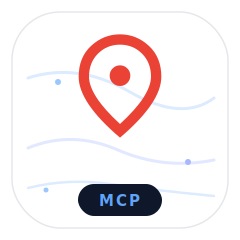

<p align="center">
  
</p>

# Google Maps MCP Server

[](https://pypi.org/project/gmaps-mcp/)
[](https://www.python.org/downloads/)
[](https://opensource.org/licenses/MIT)
[](https://modelcontextprotocol.io)

`gmaps-mcp` is an **MCP server that gives Claude Desktop, Cursor, and Claude Code full Google Maps capabilities** — places search, place details, nearby search, directions, geocoding, and reverse geocoding. Install with one line (`uvx gmaps-mcp`), drop a config block into your MCP client, and your AI assistant can talk to Google Maps natively.

Built on the official [Model Context Protocol](https://modelcontextprotocol.io) Python SDK with FastMCP. Supports both **stdio transport** (local Claude Desktop / Cursor usage) and **streamable HTTP transport** (for remote deployments and A2A agent-to-agent scenarios).

<!-- TODO: record 15-second demo GIF of Claude Desktop using search_places and drop it here -->

## What you can ask Claude once it's installed

- "Find specialty coffee shops near me in San Francisco"
- "What are the best ramen places in Shibuya, Tokyo, with reviews?"
- "How long does it take to walk from Union Square to the Ferry Building?"
- "Give me driving directions from SFO to Berkeley"
- "What are the coordinates of the Eiffel Tower?"
- "What's the address at 37.8199, -122.4783?"
- "Find a 24-hour pharmacy within 2 km of these coordinates"
- "Show me the top-rated Italian restaurants in North Beach with their hours and phone numbers"

The MCP client picks the right tool automatically — you don't name it.

## Install in Claude Desktop

Edit your `claude_desktop_config.json` (Settings → Developer → Edit Config) and add:

```json
{
  "mcpServers": {
    "google-maps": {
      "command": "uvx",
      "args": ["gmaps-mcp"],
      "env": {
        "GOOGLE_MAPS_API_KEY": "your_google_maps_api_key_here"
      }
    }
  }
}
```

Restart Claude Desktop. `uvx` fetches `gmaps-mcp` from PyPI on first run and caches it — no cloning, no venv, no Docker.

## Install in Cursor

Edit `~/.cursor/mcp.json` and add:

```json
{
  "mcpServers": {
    "google-maps": {
      "command": "uvx",
      "args": ["gmaps-mcp"],
      "env": {
        "GOOGLE_MAPS_API_KEY": "your_google_maps_api_key_here"
      }
    }
  }
}
```

Restart Cursor. Done.

## Install in Claude Code

One command from your terminal:

```bash
claude mcp add google-maps \
  -e GOOGLE_MAPS_API_KEY=your_google_maps_api_key_here \
  -- uvx gmaps-mcp
```

Confirm with `claude mcp list`.

## Get a Google Maps API key

You need a Google Maps Platform API key with **Places API (New)**, **Directions API**, and **Geocoding API** enabled. It takes 3 minutes. Google gives **$200/month in free Maps credit**, far more than solo or small-team use will ever consume.

### Step-by-step

1. Go to [Google Cloud Console](https://console.cloud.google.com/) and create (or pick) a project.
2. **Enable billing** on the project. This is required even for the free tier. If you skip this step, every Google Maps call will return `403 BILLING_DISABLED` (see [Troubleshooting](#troubleshooting)). Add a card — the free credit runs first, so you will not be charged for normal use.
3. Enable these APIs in **APIs & Services → Library**:
   - **Places API (New)** — powers `search_places`, `get_place_details`, `search_nearby`
   - **Directions API** — powers `get_directions`
   - **Geocoding API** — powers `geocode`, `reverse_geocode`
4. Go to **APIs & Services → Credentials → + CREATE CREDENTIALS → API key**.
5. (Recommended) Click the new key → **Edit** → **API restrictions** → restrict to just those three APIs.
6. Copy the key into your MCP client config above.

## Tools

All six tools are real Google Maps calls against live data. No mocks, no stub responses.

| Tool | What it does |
|---|---|
| [`search_places`](#search_places) | Text search for businesses, landmarks, POIs |
| [`get_place_details`](#get_place_details) | Reviews, amenities, hours, phone, price level for a specific place |
| [`search_nearby`](#search_nearby) | Find places within a radius of GPS coordinates, filtered by type |
| [`get_directions`](#get_directions) | Step-by-step routes — driving, walking, bicycling, transit |
| [`geocode`](#geocode) | Address or landmark → GPS coordinates |
| [`reverse_geocode`](#reverse_geocode) | GPS coordinates → human-readable address |

### `search_places`

Text search for places by natural-language query. Returns businesses, landmarks, and points of interest with ratings, addresses, phone numbers, websites, opening hours, and coordinates.

**Ask Claude:**
- "find specialty coffee shops in San Francisco"
- "best ramen in Shibuya"
- "24-hour pharmacies in Brooklyn"
- "pet-friendly cafes near Golden Gate Park"

**Returns:** `query`, `total_results`, `places[]` with `name`, `address`, `phone`, `website`, `google_maps_url`, `rating`, `reviews_count`, `price_level`, `types`, `latitude`, `longitude`, `is_open_now`, `opening_hours`, `business_status`.

### `get_place_details`

Get rich details about a specific place using its Google Place ID (returned by `search_places`). Includes reviews, amenities, editorial summary, and payment options.

**Ask Claude:**
- "show me the reviews for that first coffee shop"
- "is the second restaurant dog-friendly? do they have outdoor seating?"
- "what are the opening hours and phone number of the place I just asked about"

**Returns:** everything from `search_places` plus top 5 `reviews` (author, rating, text, relative time), `editorial_summary`, and amenity flags: `delivery`, `dine_in`, `takeout`, `reservable`, `outdoor_seating`, `live_music`, `payment_options`, `accessibility_options`.

### `search_nearby`

Find places within a radius of specific GPS coordinates. Use after `geocode` gives you a location, or when the user provides coordinates directly.

**Ask Claude:**
- "find cafes within 500 meters of these coordinates"
- "what hotels are within 2 km of the Eiffel Tower?"
- "show me gas stations within 5 km of 37.7955, -122.3937"

**Parameters:** `latitude`, `longitude`, `radius_meters` (max 50,000), `place_type` (optional — `restaurant`, `cafe`, `bar`, `hotel`, `gas_station`, `pharmacy`, `hospital`, etc.), `max_results`.

**Returns:** `center`, `radius_meters`, `place_type`, `total_results`, `places[]` with the same fields as `search_places`.

### `get_directions`

Step-by-step navigation between two locations, with total distance and duration. Supports driving (with traffic-aware duration), walking, bicycling, and public transit.

**Ask Claude:**
- "how do I walk from Union Square to the Ferry Building?"
- "give me driving directions from SFO to Berkeley with traffic"
- "bicycle route from Central Park to Times Square"

**Parameters:** `origin` (address, landmark, or `"lat,lng"`), `destination` (same), `mode` (`"driving"` default, `"walking"`, `"bicycling"`, `"transit"`).

**Returns:** `origin`, `destination`, `mode`, `routes[]` with `summary`, `legs[]` containing `start_address`, `end_address`, `distance`, `duration`, `duration_in_traffic`, and `steps[]` with step-by-step `instruction`, `distance`, `duration`.

### `geocode`

Convert an address, landmark, or place description into GPS coordinates.

**Ask Claude:**
- "what are the coordinates of the Eiffel Tower?"
- "geocode 1600 Amphitheatre Parkway, Mountain View"
- "find the latitude and longitude of Ferry Building San Francisco"

**Returns:** `query`, `formatted_address`, `latitude`, `longitude`, `place_id`, `location_type`, `types`.

### `reverse_geocode`

Convert GPS coordinates into a human-readable address.

**Ask Claude:**
- "what's at 37.8199, -122.4783?"
- "reverse geocode these coordinates: 48.8584, 2.2945"
- "what address is at latitude 40.7580, longitude -73.9855?"

**Returns:** `latitude`, `longitude`, `formatted_address`, `place_id`, `address_components[]`.

## Troubleshooting

### `403 BILLING_DISABLED` / `403 Forbidden` from Google

This is the most common setup issue. The error looks like:

```
Google Maps API error: 403 - {
  "error": {
    "code": 403,
    "message": "This API method requires billing to be enabled...",
    "status": "PERMISSION_DENIED",
    "details": [{"reason": "BILLING_DISABLED", ...}]
  }
}
```

**Fix:** Go back to [step 2 of the API key setup](#get-a-google-maps-api-key) and enable billing on your GCP project. Billing is required even though you will never actually be charged for normal solo use (Google's $200/month free credit handles it). **Wait 2-3 minutes** after enabling for the change to propagate through Google's systems, then retry.

### `API_KEY_INVALID` / `API project not authorized`

You enabled billing but forgot to enable the specific APIs. Go back to [step 3](#get-a-google-maps-api-key) and turn on Places API (New), Directions API, and Geocoding API individually.

### `uvx: command not found`

Install [`uv`](https://docs.astral.sh/uv/) first: `curl -LsSf https://astral.sh/uv/install.sh | sh` (macOS/Linux) or `powershell -c "irm https://astral.sh/uv/install.ps1 | iex"` (Windows).

### Tools work in HTTP mode but not stdio (or vice versa)

Both transports share the exact same client and tool implementations — if one works, the other should too. If you hit a mismatch, open an issue with the error output.

## Why this MCP server

If you're searching PyPI for a Google Maps MCP server, you'll find a couple of options. Here's what's different about `gmaps-mcp`:

- **Both transports in one package.** Stdio for Claude Desktop / Cursor / Claude Code local usage, streamable HTTP for remote deployment and A2A scenarios. Same codebase, same tools, same behavior.
- **All six Google Maps capabilities.** Not just search — places details, nearby search, directions with traffic, geocoding, reverse geocoding.
- **Uses Places API (New).** The current Google Places API, not the legacy v1 endpoints that Google has deprecated.
- **Real FastMCP implementation.** Built on the official MCP Python SDK, not a hand-rolled protocol parser.
- **MIT licensed, zero telemetry.** Your queries never leave your machine except to hit Google's APIs directly.
- **Tested against the real API.** Every tool is verified end-to-end against live Google endpoints on both transports.

## Remote HTTP server mode

For deployments, shared team usage, or A2A agent-to-agent scenarios, `gmaps-mcp` also runs as a streamable HTTP server with optional API key auth.

```bash
git clone https://github.com/arthurkatcher/google-maps-mcp
cd google-maps-mcp
uv sync
cp .env.example .env  # edit with your API key
python run.py
```

Server listens on `http://127.0.0.1:8000` by default, MCP endpoint at `/mcp/`, health check at `/health`. For local-only use you can leave `MCP_API_KEY` unset.

> ⚠️  **Before exposing the server publicly** (ngrok, reverse proxy, LAN, etc.):
> set `MCP_API_KEY` to a random secret. Without it, anyone who reaches the URL
> can run searches against your billed `GOOGLE_MAPS_API_KEY`. Also bind to
> `127.0.0.1` and let your tunnel/proxy forward from there, rather than
> binding `0.0.0.0` directly.

```bash
# .env
MCP_API_KEY=$(openssl rand -hex 32)
MCP_HOST=127.0.0.1

# then
python run.py
ngrok http 8000 --host-header=rewrite
# clients call https://your-ngrok-url.ngrok-free.dev/mcp/ with X-API-Key: <secret>
```

> ℹ️  **Why `--host-header=rewrite`.** The MCP Python SDK's HTTP transport
> validates the `Host` header to block DNS-rebinding attacks against
> localhost servers. ngrok's default forwards the public hostname, which the
> SDK rejects with `421 Invalid Host header`. `--host-header=rewrite` makes
> ngrok forward the upstream `Host` (`127.0.0.1:8000`), which passes the
> check. The same reasoning applies to other tunnels and reverse proxies —
> set the upstream `Host` to your bind address.

### Security considerations

When you run `gmaps-mcp` over HTTP, treat `MCP_API_KEY` as a credential that
gates a billed Google Cloud account. A few operator-side defaults worth
having in place:

- **Rotate the key on suspected exposure.** It's a single env var; pasting it
  in a screenshot, committed log, or shared session is enough to leak it.
- **Set a Google Cloud billing alert** on the GCP project that holds your
  `GOOGLE_MAPS_API_KEY`. Pick a threshold that's well under whatever number
  would ruin your week. This is the cheap backstop against any leak —
  your key, the MCP key, or a third-party scraping the tunnel URL.
- **Restrict the Google Maps API key** to just the three APIs `gmaps-mcp`
  uses (Places API New, Directions, Geocoding) under *APIs & Services →
  Credentials → Edit*. Optionally pin it to your home/server IP for
  defense in depth.
- **No server-side rate limiting yet.** A leaked `MCP_API_KEY` lets an
  attacker burn quota as fast as their bandwidth allows. Until that lands,
  the billing alert is your circuit breaker.
- **Don't expose `MCP_HOST=0.0.0.0` without a key.** If you do, the server
  refuses to start (this is enforced in 0.1.3+ — a deliberate guardrail
  added after [GHSA-52cq-7v8r-62c6][1]).

[1]: https://github.com/arthurkatcher/google-maps-mcp/security/advisories/GHSA-52cq-7v8r-62c6

## Pricing

Google's Maps Platform offers a **$200/month free credit** that covers roughly:

- ~11,000 Places API (New) requests, or
- ~40,000 Geocoding API requests, or
- ~40,000 Directions API requests.

For solo or small-team use, you will almost never hit the cap. Past the free tier, expect approximately $17 per 1,000 Places requests and $5 per 1,000 Geocoding/Directions requests. See [Google Maps Platform pricing](https://developers.google.com/maps/billing-and-pricing/pricing) for current rates.

## Development

```bash
git clone https://github.com/arthurkatcher/google-maps-mcp
cd google-maps-mcp
uv sync
cp .env.example .env  # add your real API key

# Run in stdio mode (for local MCP clients)
uv run python -m google_maps_mcp

# Run in HTTP mode (for remote clients)
uv run python run.py
```

## Roadmap

- **Places API v2 fields** — exploiting newer review/media fields as Google rolls them out
- **Traffic-aware ETA tool** — dedicated tool for real-time travel time with traffic
- **Place photos** — tool to fetch `PlacePhoto` URLs for UI rendering
- **Static maps rendering** — optional tool to return a static map image for a place or route
- **Autocomplete suggestions** — for building typeahead UX on top of the MCP server
- **MCP registry submission** — listing on [registry.modelcontextprotocol.io](https://registry.modelcontextprotocol.io) once it stabilizes

## Project structure

```
google-maps-mcp/
├── pyproject.toml
├── README.md
├── LICENSE
├── run.py                    # HTTP server entry point
└── src/google_maps_mcp/
    ├── __init__.py
    ├── __main__.py           # stdio server entry point
    ├── client.py             # Google Maps API client
    ├── tools.py              # Tool wrappers
    └── server.py             # FastMCP server + Starlette HTTP middleware
```

## License

MIT — see [LICENSE](LICENSE). Use it anywhere, fork it, ship it.

## Credits

Built by [Arthur Katcher](https://github.com/arthurkatcher). Contributions, bug reports, and PRs welcome at [github.com/arthurkatcher/google-maps-mcp](https://github.com/arthurkatcher/google-maps-mcp).

If this MCP server saves you time, a GitHub star is the only payment I ask for.
